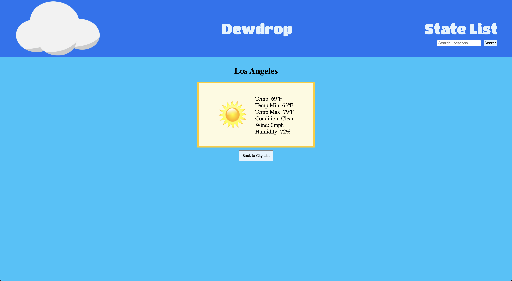

# Dewdrop
An application to check the current weather status in the United States.

Link to the app -> https://ga-project-weather-app.herokuapp.com/

## Technologies Used
React.js | JavaScript | CSS | HTML

## User Stories
This app is meant for people looking to check current weather status of cities within the United States.

## Walkthrough
This is the home page where you will see 10 constant cities listed for quick access.

State list screen.

City list screen.

Result page.

## Wireframe
Original concept layout for the app.

Original concept for component relations.

## Unsolved Problems/Issues
I would like to impliment a weather map showing the US current conditions on the home page

Adding additional information to each result page such as future forecast (hourly for the day and weekly).

Fix guard against input in the search bar from loading when a non-city string is entered.